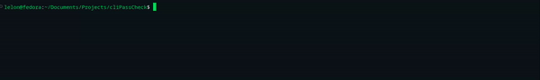

# Password Checker CLI

A Node.js command-line application for password validation and generation. This tool allows you to generate secure passwords and validate them against configurable criteria, such as minimum length, number of digits, and special characters. You can specify these criteria directly via command-line arguments or through a configuration file with a `.cpc` extension.



## Features

- Generate cryptographically secure passwords
- Validate passwords against customizable criteria
- Support for configuration files with `.cpc` extension
- Colored output for better readability
- Near 100% test coverage
- Thoroughly tested password generation and validation

## Installation

1. Clone the repository:

   ```sh
   git clone https://github.com/LelonDelonMelon/cliPassCheck.git
   cd cliPassCheck
   ```

2. Install dependencies:

   ```sh
   npm install
   ```

## Usage

The CLI provides two main commands: `generate` and `validate`.

### Generating Passwords

Generate a password using command-line arguments:

```sh
node index.js generate --minLength 12 --minDigits 2 --minSpecials 2 --minUppercase 1 --minLowercase 1
```

Generate a password using a configuration file:

```sh
node index.js generate --config "./config/example.cpc"
```

### Validating Passwords

Validate a password using command-line arguments:

```sh
node index.js validate --password "YourPassword123!" --minLength 8 --minDigits 2 --minSpecials 1
```

Validate a password using a configuration file:

```sh
node index.js validate --password "YourPassword123!" --config "./config/example.cpc"
```

## Configuration File Format

The configuration file should have a `.cpc` extension and contain key-value pairs for the criteria. For example:

```ini
# example.cpc
minLength = 16
maxLength = 32
minDigits = 2
minSpecials = 2
minUppercase = 2
minLowercase = 2
noRecurring = true
```

Comments start with `#` and are ignored.

## Password Requirements

All passwords are validated against the following criteria:

- Minimum length (`--minLength`, default: 8)
- Maximum length (`--maxLength`, default: 32)
- Minimum number of digits (`--minDigits`, default: 1)
- Minimum number of special characters (`--minSpecials`, default: 1)
- Minimum number of uppercase letters (`--minUppercase`, default: 1)
- Minimum number of lowercase letters (`--minLowercase`, default: 1)
- Option to disallow recurring characters (`--noRecurring`, default: false)

## Test Coverage

The codebase is thoroughly tested with Jest, achieving exceptional coverage metrics:

```
------------------------|---------|----------|---------|---------|-------------------
File                    | % Stmts | % Branch | % Funcs | % Lines | Uncovered Line #s
------------------------|---------|----------|---------|---------|-------------------
All files              |   99.13 |    98.14 |     100 |   99.09 |
 config                |     100 |      100 |     100 |     100 |
  configReader.js      |     100 |      100 |     100 |     100 |
 generators            |   97.72 |    93.75 |     100 |   97.61 |
  passwordGenerator.js |   97.72 |    93.75 |     100 |   97.61 | 102
 validators            |     100 |      100 |     100 |     100 |
  index.js            |     100 |      100 |     100 |     100 |
```

### Test Suite Overview

The comprehensive test suite includes:

#### Unit Tests

- **Validators**: Tests for each validation rule (length, digits, special chars, case)
- **Password Generator**: Tests for password generation with various criteria
- **Config Reader**: Tests for config file parsing and validation

#### Integration Tests

- **CLI Commands**: End-to-end testing of generate and validate commands
- **Config Integration**: Testing config file usage with both commands
- **Error Handling**: Testing CLI error messages and exit codes

#### Edge Cases and Error Conditions

- Invalid config file formats
- Missing required parameters
- Boundary conditions for all numeric parameters
- Error handling for strict password requirements
- Cryptographic randomness verification

To run the tests with coverage report:

```sh
npm test --coverage
```

## Contributing

Contributions are welcome! Please follow these steps:

1. Fork the repository
2. Create your feature branch (`git checkout -b feature/amazing-feature`)
3. Write and test your changes
4. Ensure test coverage remains high (`npm test -- --coverage`)
5. Commit your changes (`git commit -m 'Add some amazing feature'`)
6. Push to the branch (`git push origin feature/amazing-feature`)
7. Open a Pull Request

For major changes, please open an issue first to discuss what you would like to change.

## Dependencies

- Node.js (v12 or higher)
- yargs: Command-line argument parsing
- crypto: Cryptographically secure random number generation

## License

[MIT](https://choosealicense.com/licenses/mit/)
